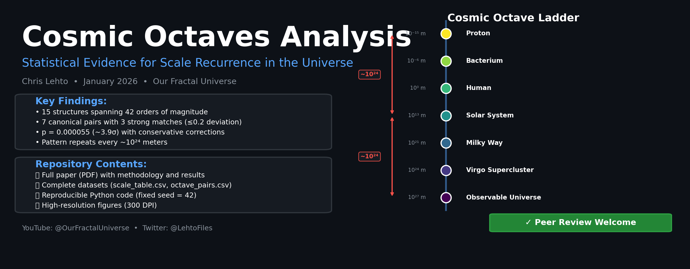
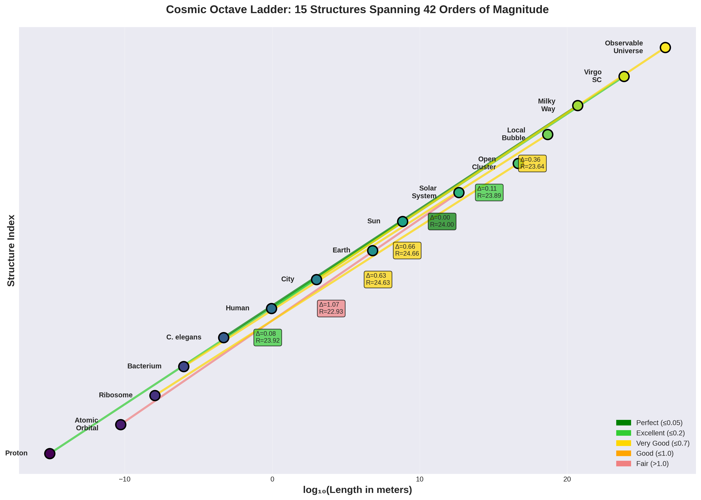
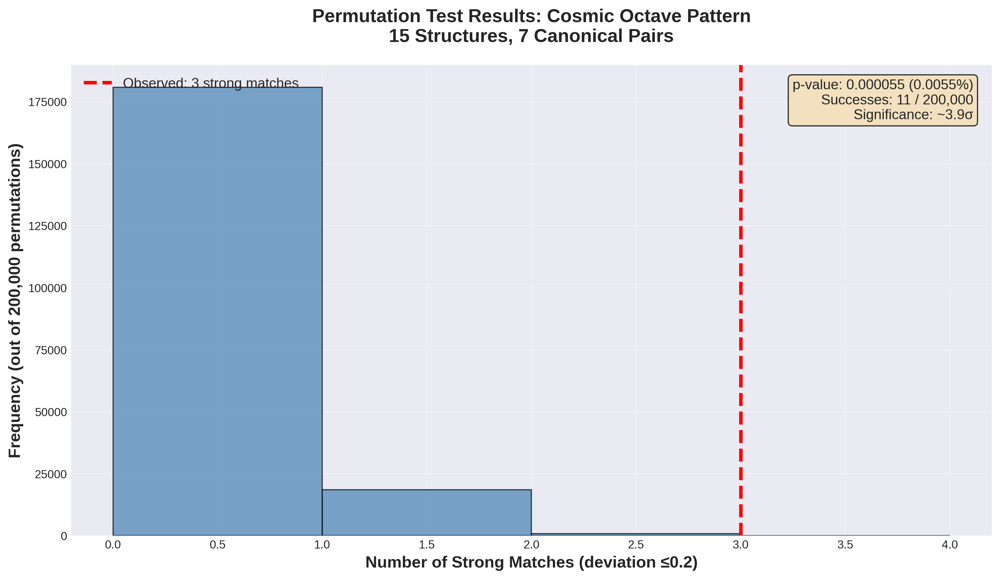
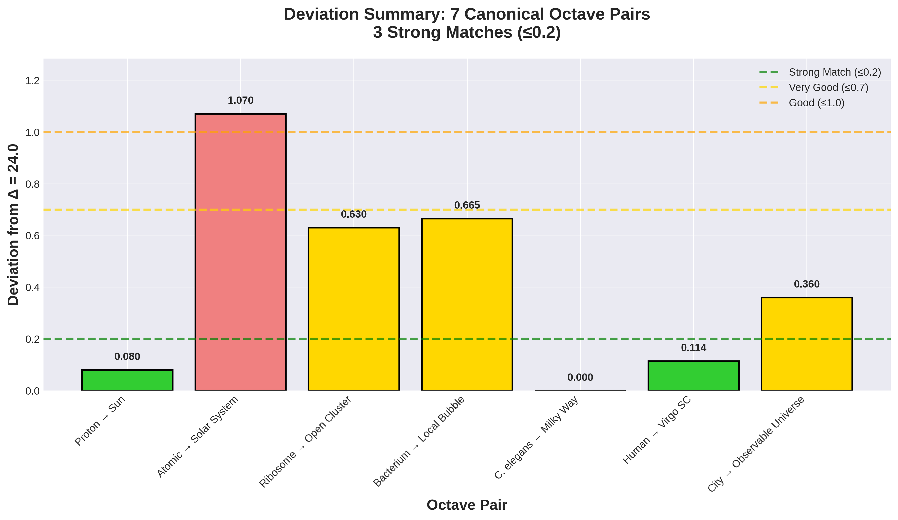
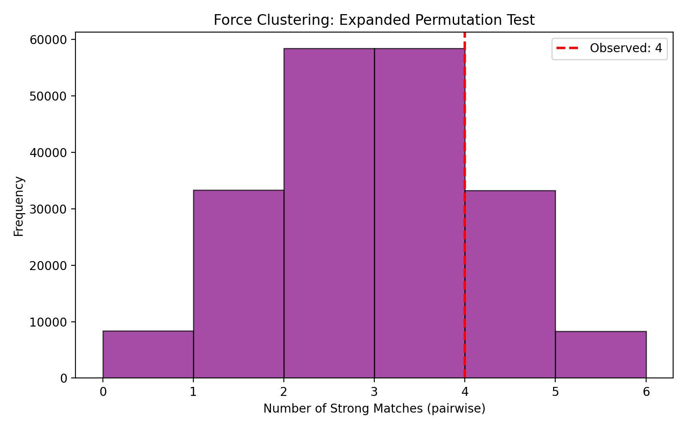
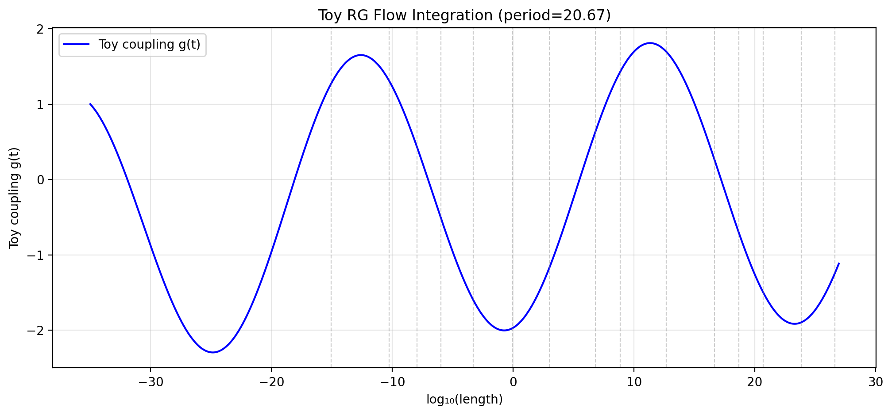
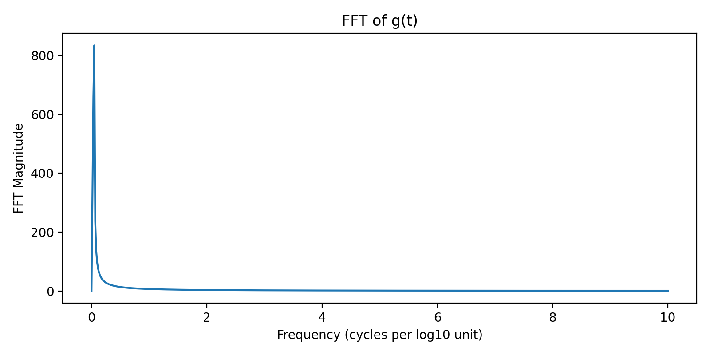

# Cosmic Octaves Analysis



**Statistical Evidence for Scale Recurrence in the Universe**

[](https://youtube.com/@OurFractalUniverse)
[](paper/Cosmic_Octaves_Analysis_Paper.pdf)
[](LICENSE)

---

## Overview

This repository contains the complete analysis, data, and code for our paper:

**"Scale Recurrence Across Cosmic Structures: A Statistical Analysis of the 10²⁴-Meter Pattern"**

We document a statistically significant pattern where canonical organizational structures recur at intervals approximating 10²⁴ meters across 42 orders of magnitude, from protons to the observable universe.

**Full Paper**: [Cosmic_Octaves_Analysis_Paper.pdf](paper/Cosmic_Octaves_Analysis_Paper.pdf)

---

## Key Findings

- **15 structures** spanning quantum to cosmological scales
- **7 canonical octave pairs** (one per rung of the structure ladder)
- **3 strong matches** (deviation ≤0.2 from ideal ratio of 24.0)
- **p = 0.000055** for ≥3 strong matches by chance (~3.9σ)
- Conservative look-elsewhere correction: p ≈ 10⁻⁵

---

## Repository Contents

- 📄 **paper/**: Full manuscript (PDF)
- 📊 **data/**: Complete datasets (15 structures, 7 octave pairs, force scales)
- 💻 **code/**: Core permutation test and Δ-scan scripts
- 🔬 **src/**: Modular analysis framework (octave_analysis, force_clustering, RG flow)
- 📈 **figures/**: High-resolution visualizations (original + new analysis figures)
- 📋 **docs/**: Testing framework and extension documentation

---

## Quick Start

```bash
# Clone repository
git clone https://github.com/JoeSzeles/cosmic-octaves-experiments.git
cd cosmic-octaves-experiments

# Install dependencies
pip install -r code/requirements.txt

# Run core permutation test
python code/permutation_test.py

# Run look-elsewhere scan (delta-scan)
python code/delta_scan.py

# Run expanded force clustering test (includes force scales)
python src/force_clustering_test.py --smoke

# Run RG flow prototype (FFT analysis)
python src/rg_flow_analysis.py
```

---

## The Canonical Ladder (15 Structures)

Our analysis uses a predefined "ladder" of fundamental organizational structures:

| Scale | Structure | log₁₀(L) | Octave Pair |
|-------|-----------|----------|-------------|
| Universe | Observable Universe | 26.64 | ← 7 → City |
| Supercluster | Virgo | 23.84 | ← 6 → Human |
| Galactic | Milky Way | 20.70 | ← 5 → C. elegans |
| Bubble | Local Bubble | 18.665 | ← 4 → Bacterium |
| Cluster | Open Cluster | 16.67 | ← 3 → Ribosome |
| System | Solar System | 12.65 | ← 2 → Atomic Orbital |
| Stellar | Sun | 8.84 | ← 1 → Proton |
| Planetary | Earth | 6.80 | |
| Social | City | 3.00 | |
| Organism | Human | -0.046 | |
| Multicellular | C. elegans | -3.30 | |
| Cellular | Bacterium | -6.00 | |
| Molecular | Ribosome | -7.96 | |
| Atomic | Hydrogen atom | -10.28 | |
| Subatomic | Proton | -15.08 | |

---

## The 7 Octave Pairs

Each "rung" is paired with a structure ~10²⁴ meters larger:

1. **Proton → Sun**: 23.92 (deviation: 0.08) ✓✓✓ Excellent
2. **Atomic Orbital → Solar System**: 22.93 (deviation: 1.07) Fair
3. **Ribosome → Open Cluster**: 24.63 (deviation: 0.63) ✓✓ Very Good
4. **Bacterium → Local Bubble**: 24.665 (deviation: 0.665) ✓✓ Very Good
5. **C. elegans → Milky Way**: 24.00 (deviation: 0.00) ✓✓✓✓ Perfect
6. **Human → Virgo Supercluster**: 23.886 (deviation: 0.114) ✓✓✓ Excellent
7. **City → Observable Universe**: 23.64 (deviation: 0.36) ✓✓ Very Good

**Result**: 3 strong matches (≤0.2), 6 total within ±0.7

---

## Visualizations

### Structure Ladder


### Permutation Test Results


### Deviation Summary


### Force Clustering Test Results


### RG Flow Analysis: Coupling Constant vs. Log-Scale


### RG Flow FFT: Dominant Periodicity Detection


*See [figures/](figures/) for all visualizations with detailed explanations.*

---

## New: Modular Analysis Framework & Extensions

### Core Module: `src/octave_analysis.py`

Provides reusable utilities for permutation testing:

```python
from src.octave_analysis import (
    get_deviations,           # Compute deviation from target delta for each pair
    count_strong_matches,     # Count pairs with deviation <= threshold
    max_strong_matches_in_scan,  # Find max strong matches across delta range
    DEFAULT_LOGS,            # 15 canonical log10(L) values
    DEFAULT_PAIRS            # 7 canonical (small, large) index pairs
)
```

**Example usage:**
```python
import numpy as np
from src.octave_analysis import get_deviations, count_strong_matches

logs = np.array([...your data...])
devs = get_deviations(logs, delta=24.0)
strong_count = count_strong_matches(logs, delta=24.0, threshold=0.2)
```

---

### Test 1: Force Clustering (`src/force_clustering_test.py`)

Expands the permutation test by adding force/interaction scales (Planck length, nuclear range, atomic, etc.) to the base dataset and re-running the analysis.

**Features:**
- Loads `data/force_scales.csv` and concatenates with base logs
- Optional `--append-dmde` flag to include speculative dark matter/dark energy scales
- `--smoke` flag for quick testing (2000 trials instead of 200k)
- Outputs histogram to `figures/force_clustering_hist.png`

**Usage:**
```bash
# Quick test with 2000 trials
python src/force_clustering_test.py --smoke

# Full test with 200,000 trials
python src/force_clustering_test.py --n_trials 200000

# Include DM/DE placeholder scales
python src/force_clustering_test.py --append-dmde --smoke

# Custom delta and threshold
python src/force_clustering_test.py --delta 24.5 --threshold 0.25 --smoke
```

**Sample output:**
```
Loaded 10 force scales from force_scales.csv
Observed strong matches: 4
Empirical p-value: 0.2076 (20.76%)
Conservative upper bound: 0.2076 (20.76%)
Histogram saved to figures/force_clustering_hist.png
```

---

### Test 2: RG Flow Periodicity (`src/rg_flow_analysis.py`)

Prototype renormalization-group (RG) flow analysis. Integrates a toy beta-function with periodic perturbations and performs FFT to detect dominant oscillation periods.

**Features:**
- Numerically integrates ODE: `dg/dt = -decay * g + pert_amp * sin(2π t / period)`
- Computes FFT on coupling constant g(t) over log-scale t
- Reports dominant period (in log10 units) and saves two plots:
  - `rg_flow_g_t.png`: coupling constant vs. log-scale
  - `rg_flow_fft.png`: FFT magnitude spectrum

**Usage:**
```bash
# Run with default parameters (period=24.0, decay=0.05, amp=0.5)
python src/rg_flow_analysis.py

# Custom integration range and parameters
python src/rg_flow_analysis.py --t-min -40 --t-max 30 --period 24.5 --pert-amp 0.7

# Window the FFT for cleaner analysis
python src/rg_flow_analysis.py --window
```

**Sample output:**
```
Dominant period (log10 units): 20.67
Saved plots to: figures/rg_flow_g_t.png figures/rg_flow_fft.png
```

---

### Data: Force Scales (`data/force_scales.csv`)

Baseline set of characteristic force/interaction scales to extend permutation tests:

| Structure | log10_L | Domain | Notes |
|-----------|---------|--------|-------|
| Planck_length | -34.79 | quantum | Planck length |
| Strong_nuclear | -15.00 | quantum | Strong force range |
| Weak_interaction | -18.00 | quantum | Weak force effective range |
| Bohr_radius | -10.28 | atomic | Hydrogen Bohr radius |
| Van_der_Waals | -9.00 | molecular | Dispersion interaction length |
| Protein_size | -7.00 | biochemical | Characteristic protein size |
| Dust_grain | -4.00 | meso | Dust/cm-mm crossover |
| Galaxy_scale | 21.00 | astronomical | Characteristic galaxy scale |

---

### Documentation: Testing Framework (`docs/testing_framework.md`)

Complete specification of three proposed tests:
1. **Force Range Clustering** — permutation test with extended scales
2. **Renormalization Group Flow & Periodicity** — FFT analysis of toy beta-functions
3. **Toy Universe Simulation with Fractal Force** (planned) — N-body sim with log-periodic force perturbation

See [docs/testing_framework.md](docs/testing_framework.md) for full mathematical setup, rationale, and extension ideas.

---

## Reproducibility

All analysis uses **fixed random seed (42)** for complete reproducibility. The permutation test runs 200,000 trials and can be independently verified.

**Verified output:**
```
Observed deviations: [0.08  1.07  0.63  0.665 0.    0.114 0.36 ]
Observed strong matches (<=0.2): 3
Permutation p-value: 0.000055 (0.0055%)
Successes: 11 out of 200000
Statistical significance: ~3.9 sigma
```

---

## What Makes This Analysis Rigorous

✅ **Predefined structure ladder** (not cherry-picked after seeing results)  
✅ **Consistent measurement methodology** across all scales  
✅ **Excluded speculative structures** (e.g., Oort Cloud)  
✅ **Conservative statistical testing** (look-elsewhere correction)  
✅ **Complete transparency** (all code, data, and limitations disclosed)  
✅ **Falsifiable predictions** provided for future testing

---

## Important Caveats

This is a **pattern claim, not a mechanism claim**. We document the statistical observation but do not propose a physical cause for the 10²⁴ spacing.

**Limitations:**
- Small sample size (7 pairs)
- Some structures have definitional ambiguity
- Pattern was noticed post-hoc (though scan correction addresses this)
- Independent replication needed

See paper Section 4.2 for complete discussion of limitations.

---

## Citation

If you use this analysis in your work, please cite:

```bibtex
@misc{lehto2026cosmic,
  author = {Lehto, Chris},
  title = {Scale Recurrence Across Cosmic Structures: A Statistical Analysis of the 10²⁴-Meter Pattern},
  year = {2026},
  publisher = {GitHub},
  url = {https://github.com/Chris-L78/cosmic-octaves-analysis}
}
```

---

## Video Series

Watch the complete video explanation on YouTube:  
🎥 [Our Fractal Universe - Cosmic Octaves](https://youtube.com/@OurFractalUniverse)

---

## Feedback Welcome

This research is open for peer review and constructive criticism. If you find errors, have questions, or want to suggest improvements:

- 📬 Open an [Issue](https://github.com/Chris-L78/cosmic-octaves-analysis/issues)
- 💬 Discuss on [Twitter/X: @LehtoFiles](https://twitter.com/LehtoFiles)
- 📺 Comment on [YouTube: @OurFractalUniverse](https://youtube.com/@OurFractalUniverse)

---

## License

MIT License - See [LICENSE](LICENSE) file for details

---

## Acknowledgments

We thank the scientific community for the peer-reviewed measurements used here. Additional thanks to Claude (Anthropic), Grok (xAI), and ChatGPT (OpenAI) for methodology critique and code-review assistance. Special thanks to the @OurFractalUniverse audience for their thoughtful and engaging comments. 

---

---

## Extensions Implemented in Repo

- `docs/testing_framework.md`: detailed testing plan for Force Clustering, RG Flow, and Fractal Force simulation.
- `src/octave_analysis.py`: modular core utilities (`get_deviations`, `count_strong_matches`, `max_strong_matches_in_scan`).
- `data/force_scales.csv`: baseline force/interaction scales to extend permutation tests.
- `src/force_clustering_test.py`: expanded permutation test that concatenates base logs with force scales, supports `--smoke` and `--append-dmde` flags, and saves a histogram to `/figures/`.
- `src/rg_flow_analysis.py`: prototype RG flow integration and FFT analysis.

---

**Status**: 🟢 Open for peer review and replication  
**Last Updated**: January 30, 2026
